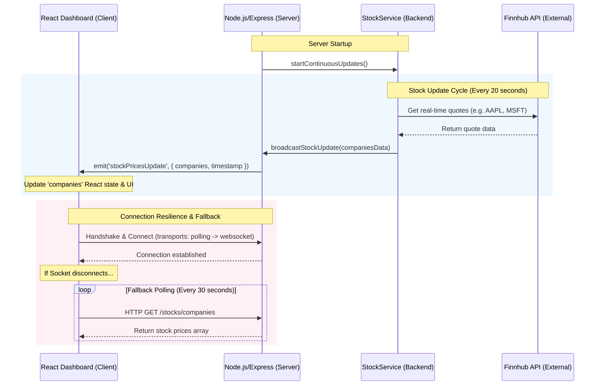

# WebSocket Implementation and Communication Techniques Analysis

This document provides a detailed end-to-end walkthrough of the WebSocket implementation in the StockTrading application, alongside a comparative analysis of modern client-server communication techniques.

---

## 1. End-to-End WebSocket Architecture in StockTrading

The application utilizes **Socket.IO** (v4.8.1) for real-time bidirectional communication. The primary objective is to stream live stock price updates from the backend to the dashboard client without requiring manual page reloads or excessive HTTP requests.

### Architectural Flow



---

## 2. Server-Side Implementation

The server-side WebSocket setup is split between the server initialization file and the stock service.

### Server Setup & Configuration
In [backend/index.js](file:///c:/CE/CE%20SEM-V/AT/StockTrading/backend/index.js), the HTTP server is created, and Socket.IO is initialized with CORS rules and connection parameters. The Socket.IO instance is also exposed globally to allow services to emit events.

```javascript
// From backend/index.js
const http = require('http');
const { Server } = require('socket.io');
const { backendUrl, corsAllowedOrigins, isProduction } = require('./config/appConfig');
const app = express();
const server = http.createServer(app);

const io = new Server(server, {
  cors: {
    origin: corsAllowedOrigins,
    methods: ["GET", "POST"],
    credentials: true
  },
  transports: ['polling', 'websocket'], // Allows upgrade from long-polling to websocket
  allowEIO3: true,
  pingTimeout: 60000,
  pingInterval: 25000,
  maxHttpBufferSize: 1e6
});

// Socket.io connection handling
io.on('connection', (socket) => {
    console.log('Client connected:', socket.id);
    
    socket.on('disconnect', () => {
        console.log('Client disconnected:', socket.id);
    });
});

// Make io available globally for stock service
global.io = io;
```

### Stock Update & Broadcast Logic
In [backend/services/stockService.js](file:///c:/CE/CE%20SEM-V/AT/StockTrading/backend/services/stockService.js), a continuous loop fetches the latest quotes from the Finnhub API and broadcasts them using `global.io`.

```javascript
// From backend/services/stockService.js
class StockService {
    // ...
    
    // Broadcast stock updates via socket
    broadcastStockUpdate(companiesData) {
        if (global.io) {
            global.io.emit('stockPricesUpdate', {
                companies: companiesData,
                timestamp: Date.now()
            });
        }
    }

    // Start continuous price updates
    startContinuousUpdates() {
        if (this.updateInterval) {
            return; // Already running
        }

        this.updateInterval = setInterval(async () => {
            if (this.isUpdating) {
                return; // Prevent overlapping updates
            }

            this.isUpdating = true;
            try {
                this.companiesCacheTime = null; // Invalidate cache
                await this.getAllCompanies(); // Fetches and calls broadcastStockUpdate() internally
            } catch (error) {
                // Silent error handling
            } finally {
                this.isUpdating = false;
            }
        }, 20000); // Update every 20 seconds
    }
}
```

---

## 3. Client-Side Implementation

The dashboard client utilizes React Context to initialize the connection and handle real-time UI updates.

### StockProvider Setup
The connection client-side is configured inside [dashboard/src/contexts/StockContext.js](file:///c:/CE/CE%20SEM-V/AT/StockTrading/dashboard/src/contexts/StockContext.js) via the `StockProvider` component.

```javascript
// From dashboard/src/contexts/StockContext.js
import io from 'socket.io-client';
import { API_BASE_URL } from '../config/api';

export const StockProvider = ({ children }) => {
  const [companies, setCompanies] = useState([]);
  const [isConnected, setIsConnected] = useState(false);
  const socketRef = useRef(null);

  const initializeSocket = useCallback(() => {
    if (socketRef.current && socketRef.current.connected) {
      return socketRef.current;
    }

    socketRef.current = io(`${API_BASE_URL}`, {
      transports: ['polling', 'websocket'],
      timeout: 30000,
      reconnection: true,
      reconnectionDelay: 2000,
      reconnectionAttempts: 5,
      autoConnect: true,
      upgrade: true,
      rememberUpgrade: true
    });

    socketRef.current.on('connect', () => {
      console.log('Socket connected successfully:', socketRef.current.id);
      setIsConnected(true);
    });

    socketRef.current.on('disconnect', (reason) => {
      console.log('Socket disconnected:', reason);
      setIsConnected(false);
      
      // Attempt manual reconnection if not disconnected intentionally
      if (reason !== 'io server disconnect' && reason !== 'io client disconnect') {
        setTimeout(() => {
          if (socketRef.current && !socketRef.current.connected) {
            socketRef.current.connect();
          }
        }, 10000);
      }
    });

    // Listen for the stockPricesUpdate event from the backend
    socketRef.current.on('stockPricesUpdate', (data) => {
      if (data && data.companies) {
        setCompanies(data.companies);
        setLastUpdated(new Date());
      }
    });

    return socketRef.current;
  }, []);

  // ...
};
```

### Fallback Polling Mechanism
A crucial resilience feature in this app is the HTTP fallback polling. If the WebSocket connection fails or disconnects, the client automatically starts polling the HTTP REST endpoint `/stocks/companies` every 30 seconds to fetch data:

```javascript
// Fallback mechanism in StockContext.js
useEffect(() => {
  const socket = initializeSocket();
  fetchCompanies(); // Initial load

  const fallbackInterval = setInterval(() => {
    if (socketRef.current && !socketRef.current.connected) {
      console.log('Socket disconnected, fetching data via HTTP...');
      fetchCompanies(); // Standard GET /stocks/companies HTTP Request
    }
  }, 30000);

  return () => {
    if (socket) {
      socket.removeAllListeners();
      socket.disconnect();
    }
    clearInterval(fallbackInterval);
  };
}, [initializeSocket, fetchCompanies]);
```

---

## 4. Comparison of Web Connection Techniques

Modern web applications use different approaches to synchronize client state with server state. Here is a brief comparison of these techniques.

| Technique | Protocol | Bidirectional | Latency | Connection Overhead | Reconnection / Resilience | Best Use Case |
| :--- | :--- | :--- | :--- | :--- | :--- | :--- |
| **Simple HTTP Request** | HTTP/1.1 or HTTP/2 | No (Request-Response) | High (Requires new request) | High (Headers sent every time) | N/A (Stateless) | One-time form submissions, page loading, static operations. |
| **Short Polling** | HTTP/1.1 or HTTP/2 | No (Client-driven) | Medium-High (Depends on interval) | Extremely High (Spams requests) | Handled by interval loop | Simple dashboard widgets with low-frequency updates where latency is not critical. |
| **Long Polling** | HTTP/1.1 or HTTP/2 | No (Client-driven, server delays response) | Medium | High (Re-establishes connection) | Native client loops | Chat applications in legacy environments that do not support WebSockets. |
| **Server-Sent Events (SSE)** | HTTP (EventStream format) | Unidirectional (Server-to-Client only) | Low | Low (Keep-alive connection) | Built-in automatic reconnection | Live sports score tickers, news feeds, system status displays. |
| **WebSockets** | WS / WSS (WS handshake upgraded from HTTP) | Yes (Full-Duplex) | Very Low (Real-time) | Low (Handshake once, then frame headers only) | Handled by application or library (like Socket.IO) | Real-time chat, multiplayer gaming, financial trading/stock dashboards. |
| **WebRTC (Data Channel)** | SCTP / UDP | Yes (Peer-to-Peer) | Extremely Low | Medium (Complex signaling setup) | Requires signaling renegotiation | P2P calling, video conferencing, peer-to-peer file sharing. |

### Summary of Techniques

1. **Simple HTTP Request (Request-Response)**
   - The standard request-response lifecycle. The client requests a resource, and the server returns it, closing the connection. 
   - *Pros*: Extremely simple, stateless, highly cacheable, works out-of-the-box.
   - *Cons*: Cannot push updates from the server to client asynchronously.

2. **Short Polling**
   - The client periodically fires standard HTTP requests to the server (e.g., every 5 seconds) to check for updates.
   - *Pros*: Simple to implement on standard REST interfaces.
   - *Cons*: Highly inefficient. Overloads servers with unnecessary requests and wastes bandwidth sending HTTP headers when no new data exists.

3. **Long Polling**
   - The client requests data. The server holds the request open until new data is available or a timeout occurs. Once the client receives data (or a timeout), it immediately establishes a new request.
   - *Pros*: Simulates real-time updates over standard HTTP without WebSocket protocols.
   - *Cons*: Still incurs the overhead of repeatedly setting up and tearing down TCP/HTTP connections.

4. **Server-Sent Events (SSE)**
   - A standard HTTP connection is kept open using the `text/event-stream` mime-type, allowing the server to push text events directly to the client.
   - *Pros*: Built-in automatic reconnection, unidirectional streaming (highly efficient for client-read-only streams), simple HTTP setup.
   - *Cons*: Unidirectional (client cannot send data back over the same socket stream; must use separate HTTP POST/PUT requests).

5. **WebSockets**
   - Establishes a persistent, TCP-based connection between the client and server through an HTTP handshake upgrade. Once open, both client and server can send lightweight binary or text frames asynchronously.
   - *Pros*: True full-duplex communication, minimal frame overhead (2-10 bytes), perfect for fast, frequent updates.
   - *Cons*: Requires special proxy support (can be blocked by some firewalls/VPNs), keeps active stateful connections on the server (requiring scaling architectures like Redis adapters).

6. **WebRTC (Data Channel)**
   - Allows direct peer-to-peer communication between two browsers using UDP/SCTP protocols, bypassed via a signaling server during negotiation.
   - *Pros*: Bypasses servers completely for low-latency peer data transfer.
   - *Cons*: Highly complex signaling handshake and network configuration (STUN/TURN servers required to bypass NATs).

---

## 5. Under-the-Hood: How the Server Sends Updates to Connected Clients

In Socket.IO and the WebSocket protocol, broadcasting updates to all connected clients is executed through a structured flow across three different layers:

### A. The Code Level (`global.io.emit`)
In [stockService.js](file:///c:/CE/CE%20SEM-V/AT/StockTrading/backend/services/stockService.js), when new stock updates are retrieved, the server invokes:
```javascript
global.io.emit('stockPricesUpdate', {
    companies: companiesData,
    timestamp: Date.now()
});
```
* **`global.io`** is the global reference to the Socket.IO server instance configured in [index.js](file:///c:/CE/CE%20SEM-V/AT/StockTrading/backend/index.js).
* Emitting on the root `io` server object targets the main namespace (`/`) and signals that this payload should be broadcasted to **all** sockets currently connected to that namespace.

### B. The Library Level (Socket.IO Adapter)
Under the hood, Socket.IO manages connections using a construct called an **Adapter**:
* **Connection Registry**: When each dashboard client connects, Socket.IO assigns them a unique ID (e.g., `socket.id`) and stores their active socket connection instance in an in-memory map.
* **Iteration loop**: When `io.emit()` is called, the default in-memory Adapter iterates over all stored socket connections in the namespace:
  ```javascript
  // Underlying logic in Socket.IO
  for (const socket of namespace.sockets.values()) {
      socket.writeToTransport(eventPayload);
  }
  ```
* *Note: If a multi-server setup (horizontal scaling) is used, Socket.IO can integrate a Redis Adapter, which publishes the event across Redis Pub/Sub so all server instances broadcast the event to their locally connected clients.*

### C. The Protocol Level (WebSocket Frames over TCP)
Once the target socket connection instances are resolved, the network delivery happens:
* **Persistent TCP Connection**: When the client first connected, it upgraded from standard HTTP to a persistent, stateful TCP connection.
* **WebSocket Frames**: The server wraps the JSON payload (`{ companies, timestamp }`) with a lightweight WebSocket frame header (just 2 to 10 bytes overhead per message depending on size).
* **Direct Network Write**: The server writes this frame directly into the TCP socket write buffer of each client's established network connection. The client's browser reads the frame and triggers the listener registered via `socket.on('stockPricesUpdate', callback)` in [StockContext.js](file:///c:/CE/CE%20SEM-V/AT/StockTrading/dashboard/src/contexts/StockContext.js).


